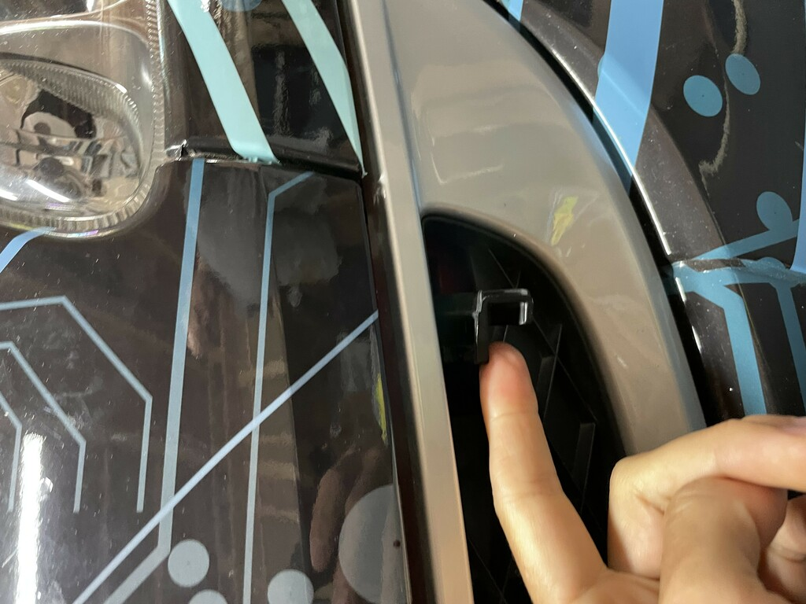

# BESSPIN-Demonstrator

```
This material is based upon work supported by the Defense Advanced
Research Project Agency (DARPA) under Contract No. HR0011-18-C-0013. 
Any opinions, findings, conclusions or recommendations expressed in
this material are those of the author(s) and do not necessarily
reflect the views of DARPA.

Distribution Statement "A" (Approved for Public Release, Distribution
Unlimited)
```

[](https://www.youtube.com/watch?v=ZgHQkOWEy1Q)

- [BESSPIN-Demonstrator](#besspin-demonstrator)
  - [Introduction](#introduction)
  - [Controls and Operation](#controls-and-operation)
    - [Scenarios](#scenarios)
    - [Reset button](#reset-button)
    - [Emergency stop](#emergency-stop)
    - [Functionality levels](#functionality-levels)
  - [Exhibit setup](#exhibit-setup)
  - [Power up](#power-up)
  - [Troubleshooting](#troubleshooting)
    - [System health monitoring](#system-health-monitoring)
    - [LEDs are off](#leds-are-off)
    - [Steering wheel doesn't respond](#steering-wheel-doesn't-respond)
    - [No sound](#no-sound)
    - [Infotainment doesn't work / No music](#infotainment-doesn't-work-no-music)
    - [Cannot shift into Park](#cannot-shift-into-park)
    - [Component failure](#component-failure)
  - [Known issues](#known-issues)
    - [Beamng reset](#beamng-reset)
    - [Steering wheel not centered after a restart](#steering-wheel-not-centered-after-a-restart)
    - [LEDs get stuck](#leds-get-stuck)


## Introduction

* [Full DARPA SSITH demonstrator video](https://www.youtube.com/watch?v=nFmaRKwB03U)
* [Short (industry version) DARPA SSITH demonstrator video](https://www.youtube.com/watch?v=ZgHQkOWEy1Q)

## Operation

### Demonstrator modes

During operation, the demonstrator is in one of the following three modes:

1. **Unprotected**
    - No SSITH protection
    - *Green* color
    - 
    <a name="unprotected-mode"></a>
2. **Hacked**
    - extension of Nominal mode
    - the car is being hacked
    - *Red* color
    - 
    <a name="hacked-mode"></a>
3. **SSITH protected**
    - uses SSITH technology for protection from hacking
    - hacks are no longer successful
    - *Blue* color
    - 
    <a name="ssith-mode"></a>

### Scenarios

There are two SSITH protected scenarios:
1. **Protected Infotainment**
    - The Infotainment is protected with SSITH technology (HARD from Lockheed Martin)
    - As a result, the hacker cannot gain hold in the system
    <a name="protected-infotainment"></a>
2. **Protected critical systems**
    - The critical systems (ECU) is protected with SSITH technology (CHERI from SRI-Cambridge)
    - The infotainment is *not* protected, and as a result the hacker can gain access to the system and launch attack on the critical systems
    <a name="protected-critical-systems"></a>


### Functionality levels
The demonstrator has 3 functionality levels, and switches between them automatically to preserve as much functionality as possible in the presence of component errors.

1. **Minimal functionality**
    - boot time: 2-3 min
    - simulator can be driven, but no hacks are possible
    - no SSITH technology is used
2. **Medium functionality**
    - boot time: ~5 min
    - only critical systems hacks can be executed
    - SSITH technology used to protect the ECU / critical systems (CHERI from SRI-Cambridge)
    - 3 FPGAs running
3. **Full functionality**
    - boot time: 15-20 min
    - all hacks and features are enabled
    - uses SSITH technology to protect the infotainment (HARD from LM), and the ECU / critical systems (CHERI from SRI-Cambridge)
    - all 6 FPGAs running

### Reset button
Reset button will reset the scenario back to the beginning.
<a name="reset-button"></a>

### Emergency stop
Emergency stop button will cut power to the force feedback system. It is located in the glove compartment.


## Experience

The demonstrator is designed for two people - a *driver* and a *hacker*. *Driver*'s role is to drive the car to the airport. The exact route doesn't really matter, as the car is on an island, and all roads eventually end up at the airport. Simply exploring the area is just fine as well.

*Hacker*'s role is to exploit a vulnerability in car's Over-The-Air (OTA) update server, gain access to the Infotainment system and hack both the infotainment and critical systems (brakes, steering, throttle, transmission)


The driver starts in [unprotected mode](#unprotected-mode), and the hacker is instructed on the hacker kiosk screen about the SSITH technology, and steps to hack the car.


The kiosk explains the process of the hacking, and its results.


The experience of being hacked while driving on a highway is jarring, and often results in the driver crashing. There is a [reset button](#reset-button) that gives the driver a "new" car and starts from the beginning.


After going through the hacking screens the demonstrator switches into [SSITH protected mode](#ssith-mode), and hacks are no longer successful. The hacker can choose from two scenarios - [protected infotainment](#protected-infotainment) and [protected critical systems](#protected-critical-systems).


The hacker is educated about the benefits of the SSITH technology, and shown a more detailed explanation how the different SSITH protections work.


The hacker is shown a hacking screen identical to the one used in the unprotected mode, but this time all the hacks fail.


Thanks to the SSITH protection, the driver enjoys the driving and is able to reach the airport (the drive to the airport takes around 5 minutes).


At the end of the scenario, the benefits of the SSITH technology are summarized once again, and the scenario is restarted.


## Exhibit setup

The car has a trailer jack for easy manipulation and staging. Once in place, the car is resting on the front supports and the back wheels. That way the front wheels can freely spin and steer, while the car is secure. For additional security add tire blocks around the rear wheels.

There are two latches hidden in the front grill that open the hood. 

1. Slide your finger behind the latch, and pull it open.
    
2. Opened right latch
    
3. Do the same for the left latch
    
4. Now pop the hood cover and slide it towards you
    
5. Spin the trailer jack to lift and move the car, and then to lower it down in the exhibit location
    
6. The main power switch is located under the hood as well, as marked below. It is ON by default, but can be switched OFF to prevent accidental power up
    
7. Close the hood by reversing the steps above

## Power up

1. Plug the main power plug into the receptacle. A standard 15A circuit is sufficient. The actual peak power draw of the demonstrator is closer to 10A. If nothing happens after power up, make sure that the main switch (located below the hood as described above) is turned ON.
2. Power up the UPS device below the rear of the car - this device must be on to powers the LED strips
    
3. Power up the steering wheel by pressing the small power button next to the emergency switch in the glove compartment. This should be done once Windows has booted, but before the simulator has started.
    
4. Center the steering wheel by rotating it until whe front wheels are aligned and the steering wheel is horizontal, as shown below.
    
5. Connect a USB keyboard and a mouse. Press Alt+Tab to switch from the simulator into Windows desktop. On the bottom system tray is located steering wheel game controller software (stylized "F" icon) <a name="calibrate-steering-wheel"></a>
    1) Press the icon
    2) Select any of the two Fanatec steering wheel controllers and press `Properties`
    3) In the new window, go to the `Settings` tab
    4) Click on `Wheel Center Calibration`
    5) Click on `Yes`
    6) The steering wheel is now centered - bring the BeamNG simulator into foreground, and press `Alt+Enter` to go back to full screen
    7) Disconnect the keyboard and the mouse
    
6. The LED lights will power cycle and change color a couple of times, until they start pulsing green.
7. The booted system looks like this:
    1. Green pulsing LEDs, similar running in self-driving mode
    
    2. Both hacker kiosk and CAN display running
    
    3. CAN display shows no errors, and displays a live feed of CAN messages passed on the CAN bus
    
    4. Initial screen of the hacker kiosk looks like this:
    


## Troubleshooting

### System health monitoring

The demonstrator has a health monitoring system, that warns the user in case an error is detected. This error is displayed in the small DEBUG window on the CAN display. Below is the debugging console on the CAN display showing MEDIUM functionality.


For more detailed view of the health monitor, `Alt+Tab` from the simulator to the terminal, and you will see a periodic summary of system health - ideally it looks like this:


Note that some components are not monitored, and their status is marked as `UNKNOWN`. All log messages are printed on the console as well as saved into `C:\Users\galois\BESSPIN-Tool-Suite\besspin\cyberPhys\ignition\ignition.demonstrator.log`

### LEDs are off
Have you turned on the LED power source? It is the power button under the rear side of the car.


### Steering wheel doesn't respond
Have you pressed the power button for the steering wheel force feedback system?


Note that even after that the simulator might not recognize the steering wheel controller, and the wheel might be off-center. Refer to the [Power up](#power-up) to see how to re-calibrate the steering wheel. Restarting the simulator/Windows PC might be necessary as well (but remember to power up the steering wheel *again* after the reset)

If the wheel still doesn't come up, open the hood and check if the light on the steering wheel hub is on.

- Steering wheel OFF:
    
- Steering wheel ON:
    

### No sound
Sounds levels can be adjusted on the Windows PC - attach a keyboard and a mouse to the USB hub in the glove compartment, press `Alt+Tab` to escape the simulator, and adjust the sound volume accordingly.

### Infotainment doesn't work / No music
First, check the CAN display for any errors. The infotainment/music works only in [Full Functionality](#functionality-levels) mode.

If no errors are displayed, make sure you are in manual mode (can drive the car) and press volume/music station button.

The last resort is to check the [System health monitoring](#system-health-monitoring) to see if there are any errors in the infotainment backend.

### Cannot shift into Park
The ignition key might be in the OFF position. Rotate the key and move the shifter to find the correct key orientation.


### Component failure
If there is a component error, the demonstrator tried to resolve it by restarting the component where possible. However, an automatic reset is not always possible, in which case an error message will be shown on the CAN display. 

Usually the best course of action is to [power cycle](#power-up) the whole demonstrator and that should resolve most of the problems.


## Known issues

Because the demonstrator uses experimental components, there are some known issues that might pop up.


### Beamng reset
[PyBeamng](https://beamngpy.readthedocs.io/en/latest/index.html) and [BeamNg](https://beamng.tech/) occasionally loses connection to the rest of the demonstrator. Usually we can reconnect within a couple of seconds, but during that time the driver might lose control of the vehicle. In the worst case, an Ignition error is displayed on the CAN display and in such case the demonstrator (or more specifically the Ignition component) has to be restarted.

### Steering wheel not centered after a restart
The [Fanatec podium wheel base](https://fanatec.com/us-en/racing-wheels-wheel-bases/wheel-bases/podium-wheel-base-dd1) does not keep its center calibration, and as a result is not perfectly aligned after a restart. This seem to be a Fanatec driver issue. To re-calibrate the steering wheel, please follow the [calibration procedure](#calibrate-steering-wheel)

### LEDs get stuck
Sometimes a segment of the LEDs get stuck in a given color/pattern. The only known remedy is to power cycle the demonstrator (more specifically restart the ignition subsystem, which manages the LEDs).
